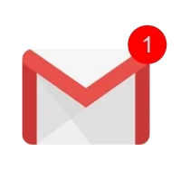

<div align='center'>
    
    <h1 align='center'>Mailing 📨</h1>
</div>

<div align="center">
    
    
</div>
 
<div align="center">
    
</div>
 
<div align="center">
    <a href='https://www.google.com/url?sa=t&rct=j&q=&esrc=s&source=web&cd=&cad=rja&uact=8&ved=2ahUKEwiFmq2GueKEAxXf_7sIHcONCvcQFnoECBEQAQ&url=https%3A%2F%2Ffr.linkedin.com%2Fin%2Ftom-blanchet&usg=AOvVaw2NyolXUeo7ja8PpF4VNmHt&opi=89978449'>
    
    </a>
</div>

Utility to make sending mail easier, particularly with Google Gmail and OAuth2.

# Install

```bash
npm install @frontboi/mailing
```

# Support

You can create a PR on this project and I will review it.
If you prefer, you can contact me on Linkedin or by email (contact@tomblanchet.fr).

# Features

This package is meant to facilitate the integration of Google's gmail API and OAuth2 for mailing. As such, it provides functions to generate Google OAuth2 client and access/refresh token to keep so you can use it for mail sending.

- `generateOAuthUrl`: returns an authentication URL to redirect your client to so that it authorizes OAuth connection.
- `validateAuthCode`: when a user successfuly authorized OAuth, he gets redirect to `GOOGLE_REDIRECT_URI` with a code in query params. Provide this code to this function in order to exchange it for access and refresh tokens.
- `forgeAccessToken`: provide a refresh token to this function, and it will yield you an access token.
- `getUserInfos`: returns general informations about the connected user.

## Setup

### Google console

You will need to setup a Google Console project. Go to [this url](https://console.cloud.google.com), and then create your application. You must include these three scopes: `/auth/userinfo.email`, `/auth/userinfo.profile` and `/auth/gmail.send` for this package to work.

### Environment variables

To use frontboi's mailing utility, these environment variables must be accessible at runtime:

- `GOOGLE_OAUTH_CLIENT_ID`
- `GOOGLE_OAUTH_SECRET`
- `GOOGLE_REDIRECT_URI`

> These values are obtained via after you have created you Google Console project.

# How to use

Here is an implementation example in an Express server:

```typescript
import { generateOAuthUrl, validateAuthCode, sendMail, getUserInfos } from '@frontboi/mailing'

import express from 'express'

const app = express()

// 1. redirect the user to the Google OAuth2 page, in order to get a code that will be used in the next step
//    the code will be sent to the GOOGLE_REDIRECT_URI endpoint - you have configured this endpoint in the Google cloud console
app.get('/authenticate', (req, res) => {
  const authUrl = generateOAuthUrl()
  res.redirect(authUrl)
})

// 2. request this endpoint with the code you obtained earlier
app.post('/get-tokens', (req, res) => {
    const { tokens } = await validateAuthCode(req.body.code)
    const { access_token, refresh_token } = tokens
    // do what you want with your tokens (save the refresh token in database for example)
})

// 3. send a mail using the token you obtained
app.get('/send-mail', (req, res) => {
    const refreshToken // get it the way you like

    // get sender's Google profile informations
    const { email, given_name, family_name } = await getUserInfos(refreshToken)

    await sendMail({
      expires: '',
      from: email,
      refreshToken,
      attachments: [],
      subject: 'Hello Henry',
      to: 'henri.letesquieux@orange.fr',
      body: `${given_name} ${family_name} managed to send a mail using Gmail !`,
    })
})

app.listen(port, () => console.log(`Server is running on http://localhost:${port}`))
```
